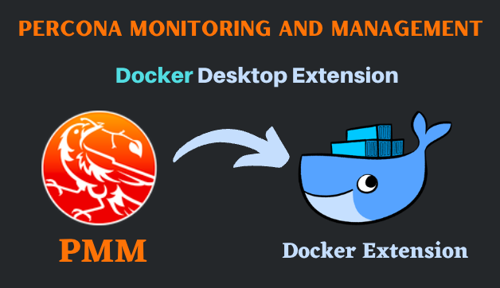
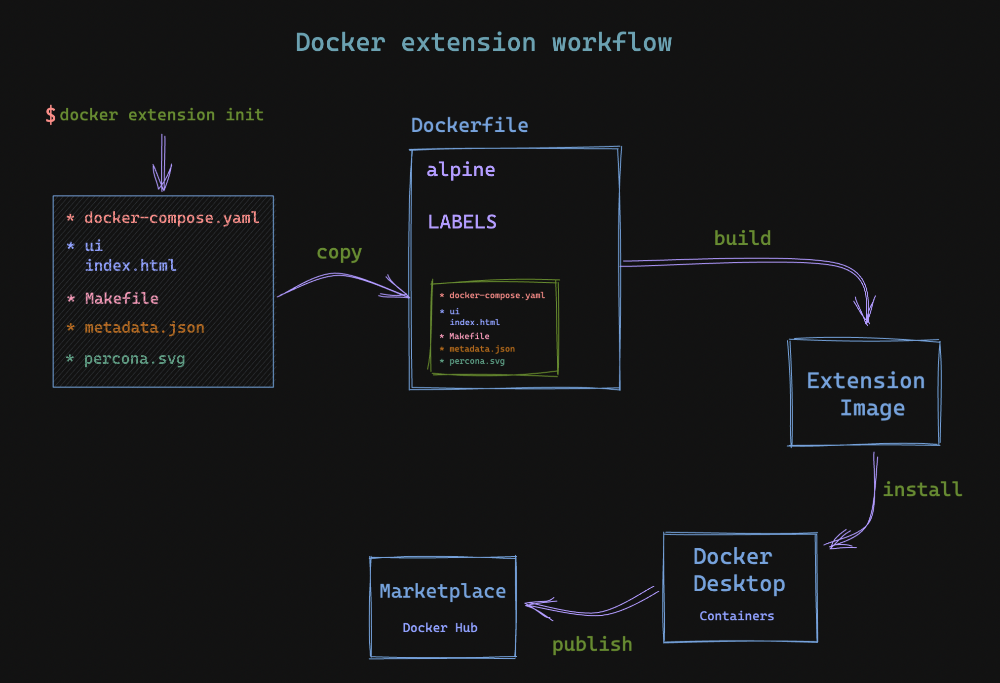
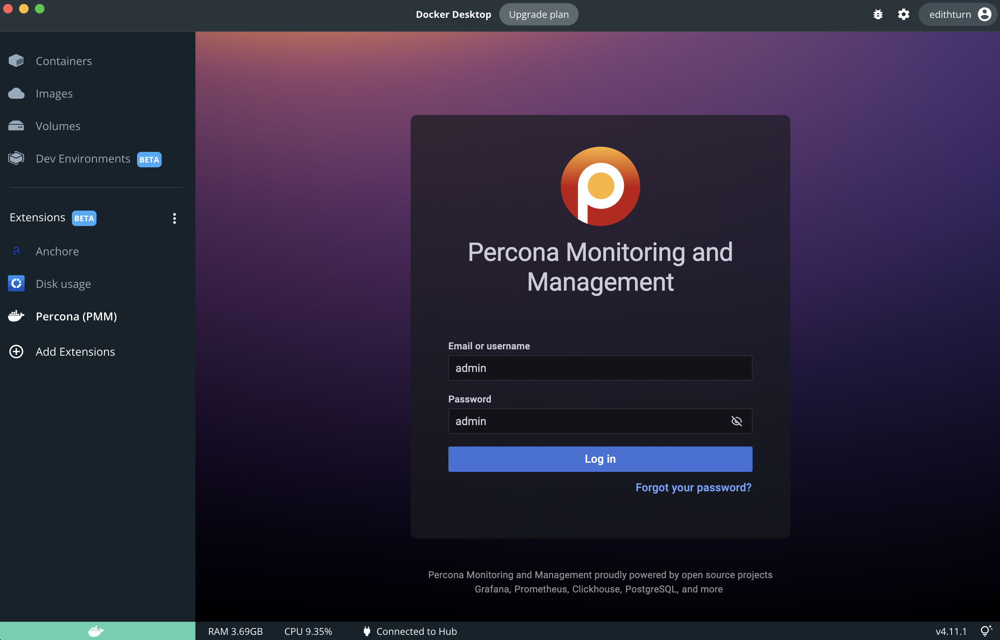
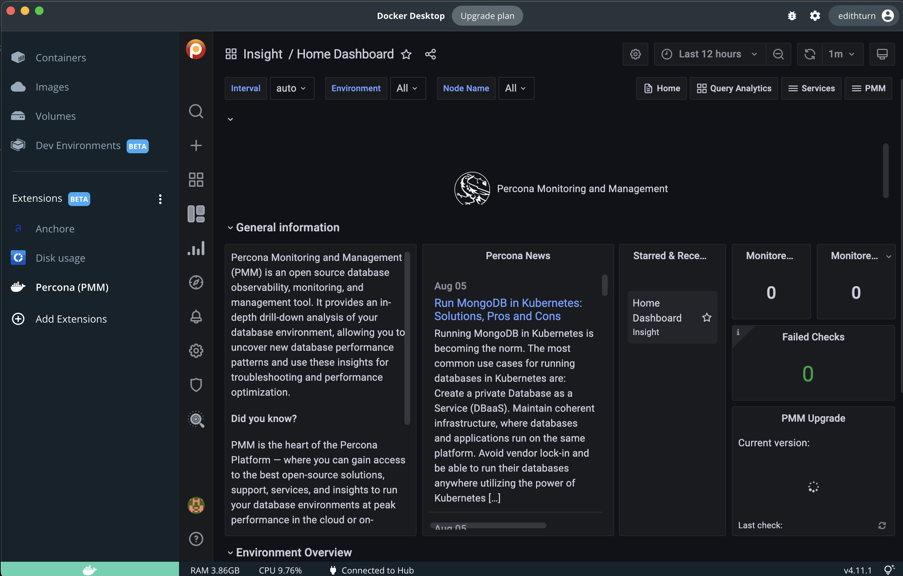

# Docker Extension for PMM

🛑🛑 It is unsupported software and not published, please consider using the officially supported method of installing PMM Server https://docs.percona.com/percona-monitoring-and-management/setting-up/index.html :)

Docker extension for Percona Monitoring and Management (PMM). We will learn how to run, install and deploy our [Docker Extension](https://docs.docker.com/desktop/extensions/).

**PMM** is a best-of-breed open source database monitoring solution. It provides great metrics of **MySQL** and **MongoDB** in depth which helps to improve performance of the database stack and helps to find root cause of any issue.

See the [PMM](https://www.percona.com/doc/percona-monitoring-and-management/2.x/index.html) Documentation for more information.

  <p align="center">
    
  </p>

## Build and install PMM Docker extension

```bash
# Build image to be deployed as  desktop extension
# After clone the repository, in pmm-docker-extension directory
make build-extension

# Install the extension
docker extension install edithturn/pmm-docker-extension:latest

# Update the extension
docker extension update edithturn/pmm-docker-extension:latest

# Extension Mode Debug
docker extension dev debug edithturn/pmm-docker-extension:latest
```

```bash
# Lists all installed extensions
docker extension ls
```

## Docker extension workflow

<p align="center">
    
</p>

## Navigate to PMM extension

Start Docker Desktop and in Extension section, Percona(PMM) extension will be ready to use.

Use admin/admin for user/password for the first time, after that It will ask you to reset your password.

<p align="center">
    
</p>

<p align="center">
    
 </p>

Special thanks to
**[James Spurin](https://github.com/spurin) Docker Captian** who was my mentor during this process.
