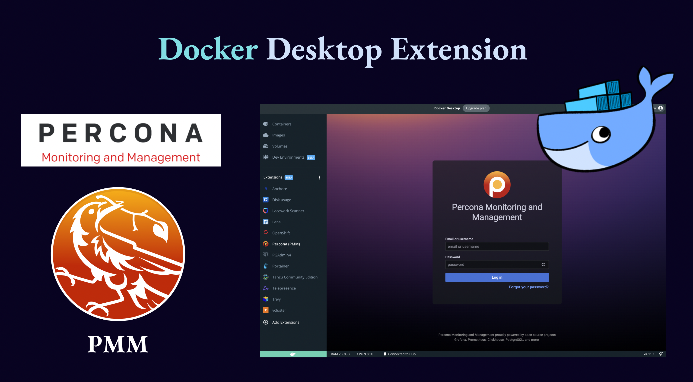

# Percona Monitoring and Management (PMM) Docker Extension

**PMM** is an open source database monitoring solution. It provides great metrics of **MySQL**, **PostgreSQL** and **MongoDB** in depth which helps to improve performance of the database stack and helps to find root cause of any issue.

⚠️ The Docker extension for Percona Monitoring (PMM), is not published yet on Percona Docker Hub or Marketplace. This is a work in progress.

**This is Work-in-progress** 🚧 🚜

- [x] Build Docker Compose File
- [x] Set UI
- [ ] Final Testing

If you are interested in using PMM please consider using the officially supported method of [installing PMM Server](https://docs.percona.com/percona-monitoring-and-management/setting-up/index.html)

<p align="center">
    
</p>

## Getting Started

Pre-requisite

- Docker Desktop 4.11

### 1. Clone PMM Docker extension repository

```bash
git clone https://github.com/edithturn/pmm-docker-extension.git
```

### 2. Build the extension

```bash
# Build the image of the extension

make build-extension
```

### 2. Install the extension

```bash
docker extension install edithturn/pmm-docker-extension:latest
```

### 3. Navigate to PMM extension

Start Docker Desktop and in Extension section, Percona(PMM) extension will be ready to use.

Use **admin/admin** for user/password for the first time, after that It will ask you to reset your password, add a more secure password.

<p align="center">
    
</p>

<p align="center">
    
</p>

See more about the [components of PMM in the oficial Percona documentation](https://docs.percona.com/percona-monitoring-and-management/details/interface.html)

## More Docker Extension commands

### Update the extension

```bash
docker extension update edithturn/pmm-docker-extension:latest
```

### Extension Mode Debug

```bash
docker extension dev debug edithturn/pmm-docker-extension:latest
```

### List all extensions

```bash
docker extension ls
```

Special thanks to
**[James Spurin](https://github.com/spurin) Docker Captian** who was my mentor during this process.

## Resources

- [Docker Extensions Oficial Documentation](https://www.docker.com/products/extensions/)
- [Docker Extensions Examples](https://github.com/docker/extensions-sdk.git)
- [Percona Monitoring Management (PMM)](https://www.percona.com/software/database-tools/percona-monitoring-and-management)
- [Installing Docker extension on Linux](https://www.youtube.com/watch?v=rGq4vYrtHSY)
